# library-management-system
RESTful API for a Library Management System.

Nama: **Dicky Aris Munandar**

Project: **Library Management System**

Tech Stack: **Java Spring Boot**

## API Documentation Swagger
Dokumentasi API lengkap tersedia melalui Swagger UI. 
[http://localhost:8080/swagger-ui/index.html#/](http://localhost:8080/swagger-ui/index.html#/)

## Flowchart
### Entity Relationship Diagram

### Application Flow Diagram

```mermaid
graph TD
    subgraph "Sistem Perpustakaan"
        subgraph "Client"
            C(Client/User)
        end

        subgraph "API Gateway"
            API[API Gateway]
        end

        subgraph "Layanan Mikro (Microservices)"
            subgraph "Layanan Autentikasi"
                AuthController["/api/auth"]
                AuthService[AuthService]
                UserDB[User Database]
            end

            subgraph "Layanan Buku & Kategori"
                BukuController["/api/buku"]
                CategoryController["/api/category"]
                BukuService[BukuService]
                CategoryService[CategoryService]
                BukuDB[Buku Database]
                CategoryDB[Category Database]
            end

            subgraph "Layanan Peminjaman"
                PeminjamanController["/api/peminjaman"]
                PeminjamanService[PeminjamanService]
                PeminjamanDB[Peminjaman Database]
            end
        end
    end

    %% Hubungan
    C -- "HTTP Request" --> API
    API -- "Route" --> AuthController
    API -- "Route" --> BukuController
    API -- "Route" --> CategoryController
    API -- "Route" --> PeminjamanController

    AuthController -- "Memanggil" --> AuthService
    AuthService -- "Mengakses" --> UserDB

    BukuController -- "Memanggil" --> BukuService
    BukuService -- "Mengakses" --> BukuDB
    BukuService -- "Mengakses" --> CategoryDB

    CategoryController -- "Memanggil" --> CategoryService
    CategoryService -- "Mengakses" --> CategoryDB

    PeminjamanController -- "Memanggil" --> PeminjamanService
    PeminjamanService -- "Mengakses" --> PeminjamanDB
    PeminjamanService -- "Mengakses" --> BukuDB
    PeminjamanService -- "Mengakses" --> UserDB

    %% Styling untuk visual yang lebih jelas
    style C fill:#f4a261,stroke:#333,stroke-width:2px
    style API fill:#a8c7f9,stroke:#333,stroke-width:2px
    style AuthController fill:#e76f51,stroke:#333,stroke-width:2px
    style BukuController fill:#e76f51,stroke:#333,stroke-width:2px
    style CategoryController fill:#e76f51,stroke:#333,stroke-width:2px
    style PeminjamanController fill:#e76f51,stroke:#333,stroke-width:2px
    style AuthService fill:#2a9d8f,stroke:#333,stroke-width:2px
    style BukuService fill:#2a9d8f,stroke:#333,stroke-width:2px
    style CategoryService fill:#2a9d8f,stroke:#333,stroke-width:2px
    style PeminjamanService fill:#2a9d8f,stroke:#333,stroke-width:2px
    style UserDB fill:#e9c46a,stroke:#333,stroke-width:2px
    style BukuDB fill:#e9c46a,stroke:#333,stroke-width:2px
    style CategoryDB fill:#e9c46a,stroke:#333,stroke-width:2px
    style PeminjamanDB fill:#e9c46a,stroke:#333,stroke-width:2px
```

